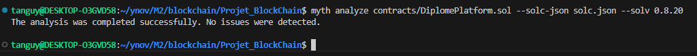

# DiplomePlatform - Blockchain Project
### Félicien COURDESSE
### Tanguy MEIGNIER
### Noah RAZZAQ

## 🎓 Description

DiplomePlatform est une application décentralisée (DApp) construite sur la blockchain Ethereum, conçue pour assurer l'authenticité des diplômes universitaires et des évaluations réalisées par les entreprises lors des stages de fin d'études (PFE).

Le projet utilise :
- **ERC-20 (DiplomeToken)** : pour récompenser les entreprises et gérer les frais de vérification.
- **ERC-721 (DiplomeNFT)** : pour émettre des diplômes sous forme de NFT.
- **DiplomePlatform** : contrat principal pour gérer les inscriptions, évaluations et vérifications.

### Vérification par Mythril



---

## 🚀 Fonctionnalités

- **Enregistrement des acteurs :** établissements, entreprises, étudiants.
- **Émission de diplômes (NFT) :** par les établissements enregistrés.
- **Évaluation des étudiants :** par les entreprises avec récompense en tokens.
- **Vérification de l'authenticité :** des diplômes contre paiement en tokens.

---

## ⚙️ Installation

### Prérequis :
- Node.js (v14+)
- Hardhat
- Blockchain locale (Besu, Ganache ou Hardhat Network)

### Étapes :
```bash
git clone https://github.com/.../Projet_BlockChain.git
cd Projet_BlockChain
npm install
```

---

## 🧪 Lancer les tests

### Réseau local Hardhat (par défaut)
```bash
npx hardhat test
```

### Réseau Besu local
```bash
npx hardhat test --network besuLocal
```

---

## 🚧 Déploiement

Créer le script `deploy.js` :

```javascript
const hre = require("hardhat");

async function main() {
  const Token = await hre.ethers.getContractFactory("DiplomeToken");
  const token = await Token.deploy();
  await token.waitForDeployment();
  console.log("DiplomeToken deployed at:", await token.getAddress());

  const NFT = await hre.ethers.getContractFactory("DiplomeNFT");
  const nft = await NFT.deploy();
  await nft.waitForDeployment();
  console.log("DiplomeNFT deployed at:", await nft.getAddress());

  const Platform = await hre.ethers.getContractFactory("DiplomePlatform");
  const platform = await Platform.deploy(
    await token.getAddress(),
    await nft.getAddress()
  );
  await platform.waitForDeployment();
  console.log("DiplomePlatform deployed at:", await platform.getAddress());
}

main().catch((error) => {
  console.error(error);
  process.exitCode = 1;
});
```

Lancer le déploiement :
```bash
npx hardhat run scripts/deploy.js --network besuLocal
```

---

## 📌 Points clés
- **Ownership (Ownable)** :
  - Si `DiplomePlatform` appelle `rewardTokens()`, transférer la propriété du token au contrat Platform et transférer un solde suffisant.
- **Roles (AccessControl)** :
  - Attribuer le rôle `MINTER_ROLE` à `DiplomePlatform` pour lui permettre de minter des NFT.

---

## 📄 Licence

Ce projet est sous licence **MIT**.
